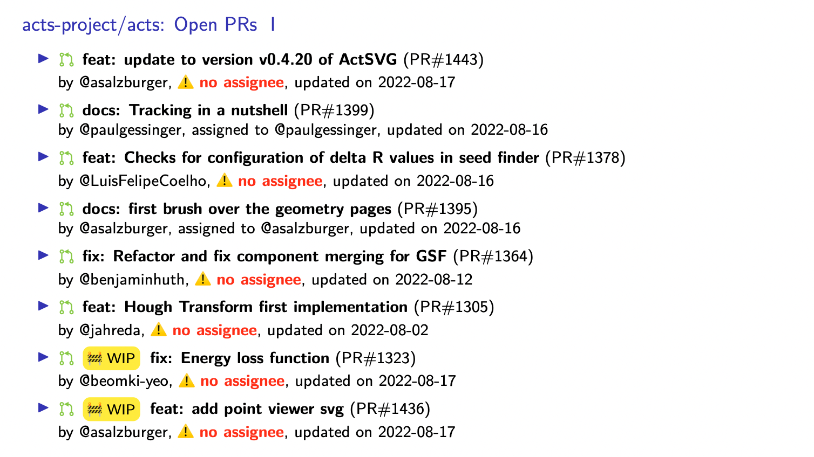

# mtng 
Generate meeting notes from GitHub + [Indico](https://getindico.io/). This tool generates
LaTeX code that can be compiled into a PDF presentation. The result looks something like this:



## Installation

```console
pip install mtng
```

## Interface

```console
$ mtng --help
Usage: mtng [OPTIONS] COMMAND [ARGS]...

  Meeting generation script, version 0.4.1

Options:
  --install-completion [bash|zsh|fish|powershell|pwsh]
                                  Install completion for the specified shell.
  --show-completion [bash|zsh|fish|powershell|pwsh]
                                  Show completion for the specified shell, to
                                  copy it or customize the installation.
  --help                          Show this message and exit.

Commands:
  generate  Generate a LaTeX fragment that includes an overview of PRs,...
  preamble  Print a preamble suitable to render fancy output
  schema    Print the configuration schema

```

```console
$ mtng generate --help
Usage: mtng generate [OPTIONS] CONFIG

  Generate a LaTeX fragment that includes an overview of PRs, Issues and
  optionally an Indico agenda

Arguments:
  CONFIG  [required]

Options:
  --token TEXT                    Github API token to use. Can be supplied
                                  with environment variable GH_TOKEN
  --since [%Y-%m-%d|%Y-%m-%dT%H:%M:%S|%Y-%m-%d %H:%M:%S]
                                  Start window for queries  [required]
  --now [%Y-%m-%d|%Y-%m-%dT%H:%M:%S|%Y-%m-%d %H:%M:%S]
                                  End window for queries  [default:
                                  2022-08-17T21:24:07]
  --event TEXT                    Optionally attach an Indico based agenda
                                  overview. This only works with public
                                  events!
  --full                          Write a full LaTeX file that is compileable
                                  on it's own
  --pdf FILE                      Compile the report as a PDF file. This
                                  requires a LaTeX installation.
  --help                          Show this message and exit.

```

## Configuration

`mtng` consumes a configuration file to specify which GitHub repositories to ingest. An example configuration could look like this:

```yml
repos:
  - name: acts-project/acts
    stale_label: Stale
    wip_label: ":construction: WIP"
    show_wip: true
    do_recent_issues: true
    no_assignee_attention: true
    filter_labels: 
      - backport
```

### Schema 
- **`Repository`** *(object)*: Cannot contain additional properties.
  - **`name`** *(string)*: Name of the repository, e.g. 'acts-project/acts'.
  - **`wip_label`** *(string)*: Label to identify WIP PRs.
  - **`show_wip`** *(boolean)*: If true, WIP PRs will be included in the output, else they are ignored. Default: `False`.
  - **`filter_labels`** *(array)*: If any PR or issue has any label that matches any of these labels, they are excluded.
    - **Items** *(string)*
  - **`stale_label`** *(string)*: A label to identify stale PRs/issues. If set, stale PRs and issues will be listed separately and split into newly and other stale items.
  - **`do_open_prs`** *(boolean)*: Show a list of open PRs. Default: `True`.
  - **`do_merged_prs`** *(boolean)*: Show a list of merged PRs. Default: `True`.
  - **`do_recent_issues`** *(boolean)*: Show a list of issues opened in the time interval. Default: `False`.
  - **`no_assignee_attention`** *(boolean)*: Draw attention to items without an assignee. Default: `True`.
- **`Spec`** *(object)*: Cannot contain additional properties.
  - **`repos`** *(array)*
    - **Items**: Refer to *#/definitions/Repository*.

This configuration will look up the `acts-project/acts` repository. The output will contain sections on 

1. Stale PRs and issues. If this is turned on, the `stale_label` key must be given as well
2. A list of open PRs, optionally filtered to not include the label given by `wip_label`
3. Merged PRs since the date given by the `--since` option
4. Issues opened since the date given by the `--since` option


In addition and independent of this config, a meeting agenda can be attached at the end if the `--event` option is provided and contains a valid Indico URL.

## Making a presentation

By default, the output of `mtng generate` is a LaTeX fragment. It has to be incorporated into a set of Beamer/LaTeX slides, for example like

```console
$ mtng generate spec.yml > gen.tex
```

with a LaTeX file like

```latex
% Preamble and beginnig of slides
\input{gen.tex}
% Rest of slides
```

Alternatively, you can generate a fully compileable LaTex document, by using the `--full` option.

```console
$ mtng generate spec.yml --full > gen.tex
$ latexmk gen.tex
```
