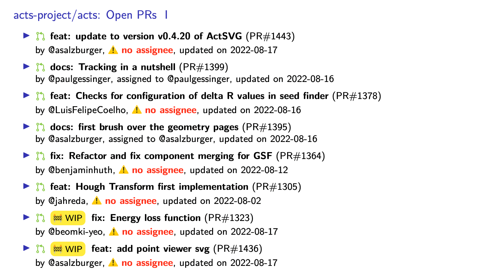

# mtng 
Generate meeting notes from GitHub + [Indico](https://getindico.io/). This tool generates
LaTeX code that can be compiled into a PDF presentation. The result looks something like this:



## Installation

```console
pip install mtng
```

## Interface

```console
$ mtng --help
Usage: mtng [OPTIONS] COMMAND [ARGS]...

  Meeting generation script, version 0.4.1

Options:
  --install-completion [bash|zsh|fish|powershell|pwsh]
                                  Install completion for the specified shell.
  --show-completion [bash|zsh|fish|powershell|pwsh]
                                  Show completion for the specified shell, to
                                  copy it or customize the installation.
  --help                          Show this message and exit.

Commands:
  auth      Authentication helpers
  generate  Generate a LaTeX fragment that includes an overview of PRs,...
  preamble  Print a preamble suitable to render fancy output
  schema    Print the configuration schema

```

```console
$ mtng generate --help
Usage: mtng generate [OPTIONS] CONFIG

  Generate a LaTeX fragment that includes an overview of PRs, Issues and
  optionally an Indico agenda

Arguments:
  CONFIG  [required]

Options:
  --token TEXT                    Github API token. Falls back to GH_TOKEN or
                                  a token stored via `mtng auth login`.
  --since TEXT                    Start window for queries. Required unless
                                  --release is used. Accepts ISO and human-
                                  readable values like "1 week ago".
  --now TEXT                      End window for queries. Accepts ISO and
                                  human-readable values like "now" or "next
                                  monday".  [default: now]
  --event TEXT                    Optionally attach an Indico based agenda
                                  overview. This only works with public
                                  events!
  --release TEXT                  Summarize merged PRs from a GitHub release
                                  tag or release URL instead of a date window.
  --preamble FILE                 Prepend this LaTeX preamble file to fragment
                                  output. Mutually exclusive with --full.
  --full                          Write a full LaTeX file that is compileable
                                  on it's own
  --pdf FILE                      Compile the report as a PDF file. This
                                  requires a LaTeX installation.
  --help                          Show this message and exit.

```

## Configuration

`mtng` consumes a configuration file to specify which GitHub repositories to ingest. YAML (`.yml` / `.yaml`), TOML (`.toml`) and JSON (`.json`) are all supported.

An example YAML configuration could look like this:

```yml
title: Weekly PR and issue update
footline_left: Core team
repos:
  - name: acts-project/acts
    stale_label: Stale
    wip_label: ":construction: WIP"
    show_wip: true
    group_prs_by_category: true
    pr_category_labels:
      feat: New features
      fix: Bug fixes
    pr_category_colors:
      feat: LimeGreen
      fix: Purple
      breaking: alertred
    pr_category_order: [fix, feat]
    do_recent_issues: true
    no_assignee_attention: true
    filter_labels: 
      - backport
```

### Schema 
- **`Repository`** *(object)*: Cannot contain additional properties.
  - **`name`** *(string)*: Name of the repository, e.g. 'acts-project/acts'.
  - **`display_name`** *(string)*: Alternative repository name. Useful when fetching one repository multiple times.
  - **`wip_label`** *(string)*: Label to identify WIP PRs.
  - **`show_wip`** *(boolean)*: If true, WIP PRs will be included in the output, else they are ignored. Default: `False`.
  - **`filter_labels`** *(array)*: If any PR or issue has any label that matches any of these labels, they are excluded. Mutually exclusive with `include_labels` and `exclude_labels`.
    - **Items** *(string)*
  - **`include_labels`** *(array)*: If set, only PRs or issues that have all of these labels are included. Mutually exclusive with `filter_labels`.
    - **Items** *(string)*
  - **`exclude_labels`** *(array)*: If any PR or issue has any label that matches any of these labels, they are excluded. Mutually exclusive with `filter_labels`.
    - **Items** *(string)*
  - **`stale_label`** *(string)*: A label to identify stale PRs/issues. If set, stale PRs and issues will be listed separately and split into newly and other stale items.
  - **`do_open_prs`** *(boolean)*: Show a list of open PRs. Default: `True`.
  - **`do_merged_prs`** *(boolean)*: Show a list of merged PRs. Default: `True`.
  - **`do_recent_issues`** *(boolean)*: Show a list of issues opened in the time interval. Default: `False`.
  - **`no_assignee_attention`** *(boolean)*: Draw attention to items without an assignee. Default: `True`.
  - **`do_reviewers`** *(boolean)*: Show reviewer information for PRs. Default: `False`.
  - **`show_review_summary`** *(boolean)*: Show review outcome text (for example, `reviewed by`). Default: `True`.
  - **`show_pr_categories`** *(boolean)*: Parse conventional-commit style prefixes from PR titles and render category pills. Default: `True`.
  - **`group_prs_by_category`** *(boolean)*: Group open and merged PR slides into one section per category. Default: `False`. Section pages are titled with the category alone (`Feature`, `Bugfix`, ...); the `fix` category also carries a 🐛.
  - **`pr_category_labels`** *(object)*: Override display names for category keys used in pills and grouped sections (for example, `feat: Feature`).
  - **`pr_category_colors`** *(object)*: Override LaTeX color names for category pills. Supports keys like `feat`, `fix`, `docs`, `other`, and `breaking`.
  - **`show_breaking_changes`** *(boolean)*: Give merged breaking PRs their own leading section. Default: `True`. See [breaking changes](#breaking-changes).
  - **`repeat_breaking_changes`** *(boolean)*: Keep breaking PRs in the regular merged/category slides as well. Default: `True`.
  - **`pr_category_order`** *(array)*: Order of the grouped category sections. Categories that are not listed follow in the default order.
    - **Items** *(string)*
  - **`frame_titles`** *(string or object)*: Override the title of a kind of frame, either as one string used for every frame or as a map. See [frame titles](#frame-titles).
  - **`Spec`** *(object)*: Cannot contain additional properties.
    - **`title`** *(string)*: Deck title shown on the title slide. Supports the [placeholders](#placeholders) `{release}`, `{repos}`, `{since}` and `{date}`. If omitted, mtng uses the default repository-based title.
    - **`footline_left`** *(string)*: Left-side text shown in the footline. Supports the [placeholders](#placeholders) `{release}`, `{repos}`, `{since}` and `{date}`. If omitted, `mtng` is used.
    - **`repos`** *(array)*
      - **Items**: Refer to *#/definitions/Repository*.
  The equivalent TOML configuration is:

```toml
title = "Weekly PR and issue update"
footline_left = "Core team"
[[repos]]
name = "acts-project/acts"
stale_label = "Stale"
wip_label = ":construction: WIP"
show_wip = true
group_prs_by_category = true
pr_category_labels = { feat = "New features", fix = "Bug fixes" }
pr_category_colors = { feat = "LimeGreen", fix = "Purple", breaking = "alertred" }
pr_category_order = ["fix", "feat"]
do_recent_issues = true
no_assignee_attention = true
filter_labels = ["backport"]
```

This configuration will look up the `acts-project/acts` repository. The output will contain sections on 

1. Stale PRs and issues. If this is turned on, the `stale_label` key must be given as well
2. A list of open PRs, optionally filtered to not include the label given by `wip_label`
3. Merged PRs since the date given by the `--since` option
4. Issues opened since the date given by the `--since` option


### PR categories

Conventional-commit prefixes on PR titles (`feat:`, `fix(core)!:`, ...) drive the pill next
to each PR and, with `group_prs_by_category`, the section a PR lands in. The defaults are:

| Key | Label | Section page | Pill color |
| --- | --- | --- | --- |
| `feat` | Feature | 🚀 | LimeGreen |
| `fix` | Bugfix | 🐛 | Purple |
| `refactor` | Refactor | ♻️ | CadetBlue |
| `perf` | Performance | ⚡ | TealBlue |
| `docs` | Docs | 📚 | CornflowerBlue |
| `test` | Tests | 🧪 | RoyalBlue |
| `build` | Build | 🔨 | Goldenrod |
| `ci` | CI | 🤖 | Orange |
| `chore` | Chore | ⚙️ | Gray |
| `revert` | Revert | 🔄 | Mahogany |
| `other` | Other | 📦 | beige |

Titles that do not parse land in `other`; a `!` marks the PR as breaking and switches the
pill to the `breaking` color. The table order is also the order of the grouped sections, and
`pr_category_order` overrides it — listed categories come first, the rest follow in the
default order:

```yml
pr_category_order: [fix, feat]
```

### Breaking changes

A `!` in the prefix (`feat!:`, `fix(core)!:`) marks a PR as breaking. Merged breaking PRs are
pulled out of the categories into a ⚠️ section of their own, ahead of the category sections,
so they lead the deck. The section is skipped when nothing broke, and only covers merged
(or, with `--release`, released) PRs — open breaking work keeps its red pill where it is.

Two switches control it, per repository:

```yml
show_breaking_changes: true      # the section itself; default true
repeat_breaking_changes: false   # list them ONLY there, not under their category
```

With `repeat_breaking_changes` left at its default, a breaking PR appears twice: once in the
breaking section and once under its own category. Set it to `false` to move them out of the
category slides entirely. Its frame title is the `breaking_changes` key in
[`frame_titles`](#frame-titles).

### Placeholders

`title` and `footline_left` are expanded before rendering, so the release the deck was
generated for can be pulled into the title slide or the footline:

```yml
title: ACTS {release}
footline_left: Core team -- {release}
```

| Placeholder | Expands to |
| --- | --- |
| `{release}` | The release tag(s) resolved from `--release`. Empty when not in release mode. |
| `{repos}` | The repositories in the spec, by `display_name` where set. |
| `{since}` | The start of the reporting window (`--since`), as `YYYY-MM-DD`. |
| `{date}` | The generation date, as `YYYY-MM-DD`. |
| `{range}` | The reporting window, as `between <since> and <now>`. |

Unknown keywords are left untouched, so `{}`-heavy LaTeX in these strings still works. A
placeholder that expands to nothing takes a dangling separator, or an empty pair of
brackets, with it: `Core team -- {release}` is just `Core team` outside of release mode.

### Frame titles

`frame_titles` overrides the title of a kind of frame, per repository, using the same
placeholders plus `{repo}` (the repository's `display_name`, or its name) and `{category}`
(the PR category, when `group_prs_by_category` is on).

A single string is shorthand for "this title, on every frame" — with the placeholders
carrying the per-frame detail, that is often all you need:

```yml
repos:
  - name: acts-project/acts
    frame_titles: "{repo} {category}"
```

A map overrides individual frames instead:

```yml
repos:
  - name: acts-project/acts
    frame_titles:
      merged_prs: "What landed {range} -- {category}"
      open_prs: "{repo}: in flight ({category})"
```

| Key | Default |
| --- | --- |
| `breaking_changes` | `{repo}: Breaking changes` |
| `merged_prs` | `{repo}: PRs merged {range} ({category})` |
| `release_prs` | `{repo}: PRs in release {release} ({category})` |
| `open_prs` | `{repo}: Open PRs ({category})` |
| `recent_issues` | `{repo}: Issues opened since {since}` |
| `new_stale` | `{repo}: New stale Issues / PRs since {since}` |
| `all_stale` | `{repo}: All stale Issues / PRs` |
| `needs_discussion` | `Needs discussion` |
| `stats` | `{repo}: period at a glance` |
| `release_stats` | `{repo}: release {release} at a glance` |

Keys are validated, so a typo is a configuration error rather than a silently ignored
setting. Only the keys you list are overridden; the rest keep their defaults. Because
`{category}` is empty unless PRs are grouped, the default `({category})` suffix disappears
by itself in ungrouped decks.

In addition and independent of this config, a meeting agenda can be attached at the end if the `--event` option is provided and contains a valid Indico URL.

If `--release` is provided, merged PRs are parsed from the release description (for links like `https://github.com/<owner>/<repo>/pull/<number>`) instead of the `--since`/`--now` range, and `--since` is optional.

## Authentication

You can provide a token explicitly with `--token`, via `GH_TOKEN`, or store one in your OS keychain:

```console
$ mtng auth login
GitHub API token: ********
Stored GitHub token for @your-user in your system keychain.
```

`mtng auth login` validates the token by default. You can also check your current token with:

```console
$ mtng auth check
GitHub token is valid for @your-user.
```

To see where the current token is loaded from:

```console
$ mtng auth status
GitHub token is configured (source: system keychain).
```

## Making a presentation

By default, the output of `mtng generate` is a LaTeX fragment. It has to be incorporated into a set of Beamer/LaTeX slides, for example like

```console
$ mtng generate spec.yml > gen.tex
$ mtng generate spec.toml > gen.tex
```

with a LaTeX file like

```latex
% Preamble and beginnig of slides
\input{gen.tex}
% Rest of slides
```

Alternatively, you can generate a fully compileable LaTex document, by using the `--full` option.

```console
$ mtng generate spec.yml --full > gen.tex
$ latexmk gen.tex
```

If you have your own deck preamble and still want direct PDF output, pass it with `--preamble` together with `--pdf`:

```console
$ mtng generate spec.yml --since 2024-01-01 --preamble mypreamble.tex --pdf notes.pdf
```

If `--preamble` points to a full `.tex` deck file (contains `\documentclass` or `\begin{document}`), `mtng` fails with an explicit error; pass a preamble-only file instead.

## GitHub Action

This repository is also a reusable action that generates the PDF summary for the project it
runs in, either for a release or for a time period. It installs a LaTeX toolchain, installs
`mtng`, and runs `mtng generate --pdf`.

Summarize every release, as it is published:

```yml
name: Release summary
on:
  release:
    types: [published]

jobs:
  summary:
    runs-on: ubuntu-latest
    steps:
      - uses: paulgessinger/mtng@v0.8.3
        with:
          title: "{repos} {release}"
          group_prs_by_category: "true"
          upload-artifact: "true"
```

The `release` input defaults to the tag of the release that triggered the workflow, and
`repository` defaults to the repository the action runs in, so the above needs no further
configuration. Merged PRs are then read from the release description.

Summarize a period instead, for example as a weekly report:

```yml
on:
  schedule:
    - cron: "0 7 * * MON"

jobs:
  summary:
    runs-on: ubuntu-latest
    steps:
      - uses: paulgessinger/mtng@v0.8.3
        with:
          since: 1 week ago
          stale_label: Stale
          do_recent_issues: "true"
          output: reports/weekly.pdf
          upload-artifact: "true"
```

Either `release` or `since` must be set. `since` and `now` accept the same ISO and
human-readable values as the CLI.

### Configuration

The action takes its configuration in one of two ways, and refuses to mix them:

- **Inline**, through the inputs named after the [config schema](#schema) fields
  (`stale_label`, `wip_label`, `group_prs_by_category`, ...), which describe a single
  repository. This is what the examples above use.
- **From a file**, through the `config` input, which points at a checked-in TOML, YAML or
  JSON config. Use this to report on several repositories, or to share the config with local
  `mtng` runs:

  ```yml
  - uses: actions/checkout@v4
  - uses: paulgessinger/mtng@v0.8.3
    with:
      config: .github/mtng.toml
      since: 1 week ago
  ```

  The config file is read from the workspace, so the workflow has to check the repository out
  first.

  Combining `config` with any of the inline spec inputs is an error, so a config file is never
  silently half-overridden.

List-valued inputs (`filter_labels`, `pr_category_order`, ...) take one entry per line or a
comma-separated list; map-valued inputs (`pr_category_labels`, `pr_category_colors`,
`frame_titles`) take `key=value` entries in the same shape:

```yml
with:
  filter_labels: |
    backport
    Stale
  pr_category_labels: feat=Feature, fix=Bugfix
```

### Action inputs

Besides the spec fields, the action accepts:

| Input | Default | Description |
| --- | --- | --- |
| `config` | | Path to a config file. Mutually exclusive with the spec inputs. |
| `repository` | current repository | Repository to summarize, as `owner/name`. |
| `release` | tag of the triggering release | Release tag or URL to summarize. |
| `since` / `now` | / `now` | Reporting window. `since` is required unless `release` is set. |
| `event` | | Indico event URL to attach as an agenda. |
| `output` | `mtng-summary.pdf` | Path of the PDF to write. |
| `tex` | | Optional path to also write the LaTeX source to. |
| `preamble` | | LaTeX preamble file to use instead of the built-in one. |
| `upload-artifact` | `false` | Upload the PDF as a workflow artifact. |
| `artifact-name` | `mtng-summary` | Name of that artifact. |
| `artifact-retention-days` | | Retention period of that artifact. |
| `token` | `github.token` | Token used for the GitHub API queries. |
| `mtng-version` | | Version to install from PyPI. Defaults to the source of the action ref itself. |
| `install-latex` | `true` | Install a LaTeX toolchain with apt. Set to `false` if the runner or container already has `latexmk`. |
| `emoji` | `true` | Also install the LuaTeX toolchain and a color emoji font, so emoji render. |
| `latex-packages` | base toolchain | apt packages to install for LaTeX. |
| `emoji-packages` | `texlive-luatex fonts-noto-color-emoji` | apt packages added when `emoji` is true. |

Outputs are `pdf` (the path of the generated PDF) and `config` (the path of the spec that was
used, generated or given).

Emoji only render under `lualatex`, which is why `emoji` pulls in an extra toolchain. Turning it
off gives a smaller, faster pdflatex-only install; the deck then compiles with the emoji left
out, which is also what happens on any TeX installation without an emoji font:

```yml
with:
  emoji: "false"
```
